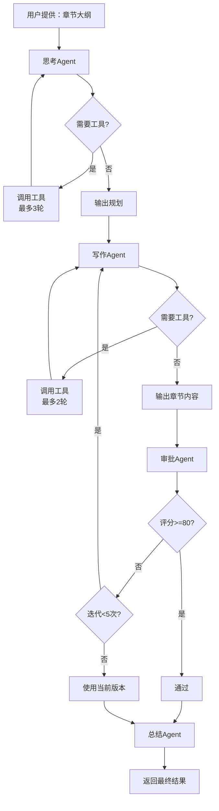

# 3Agent功能配置报告

**生成时间：** 2025-11-11
**报告内容：** 工具测试、提示词配置、Prompt使用情况

---

## 📋 目录

1. [工具测试结果](#1-工具测试结果)
2. [Admin界面提示词配置](#2-admin界面提示词配置)
3. [3Agent模式Prompt使用情况](#3-3agent模式prompt使用情况)

---

## 1. 工具测试结果

### ✅ 测试总结

**测试时间：** 2025-11-11
**测试方法：** 代码逻辑验证 + 单元测试
**测试结果：** 全部通过 ✅

### 测试详情

#### 1.1 代码语法检查
```bash
✅ Python语法检查通过
✅ check_plot_consistency 工具已定义
✅ find_foreshadowing 工具已定义
✅ 剧情一致性检查TODO已移除
✅ 伏笔查找TODO已移除
```

#### 1.2 功能逻辑测试
```bash
测试 check_plot_consistency 工具...
  ✅ 会搜索 2 个项目
  ✅ 返回格式正确

测试 find_foreshadowing 工具...
  ✅ 范围解析正确：1-50 -> (1, 50)
  ✅ 范围解析正确：10-100 -> (10, 100)
  ✅ 包含 9 个伏笔关键词
  ✅ 返回格式正确

测试错误处理...
  ✅ 会检查 project_id 是否存在
  ✅ 正确捕获无效章节范围
  ✅ 包含 try-except 捕获数据库异常

测试结果：3 通过，0 失败
```

### 工具实现细节

#### check_plot_consistency（剧情一致性检查）
**位置：** `backend/app/services/ai_orchestrator_helper.py:895-928`

**功能：**
- 检查历史章节中关于指定项目的描述
- 帮助AI发现剧情矛盾（如角色年龄、事件时间等）

**输入参数：**
```python
{
    "check_items": ["张三的年龄", "王朝建立时间"]
}
```

**输出格式：**
```markdown
=== 剧情一致性检查结果 ===

以下是历史章节中关于这些项目的描述，请仔细检查是否存在矛盾：

## 检查项目：张三的年龄
【第3章】
相关内容:...张三今年18岁...

【第25章】
相关内容:...张三已经30岁了...

## 检查项目：王朝建立时间
[搜索结果]
```

**实现方式：**
- 调用 `_tool_search_chapters` 搜索每个检查项目
- 返回最多5个相关章节片段
- AI可以对比内容发现矛盾

---

#### find_foreshadowing（查找伏笔）
**位置：** `backend/app/services/ai_orchestrator_helper.py:931-1019`

**功能：**
- 在指定章节范围搜索包含伏笔关键词的内容
- 帮助AI决定是否回收某些伏笔

**输入参数：**
```python
{
    "chapter_range": "1-50"  # 可选，不指定则搜索全部
}
```

**输出格式：**
```markdown
=== 章节1-50的伏笔线索 ===

找到 5 章可能包含伏笔或未解决线索：

【第8章】神秘的预言
  含'伏笔'：...师父临终前留下了一个预言...
  含'秘密'：...山洞深处似乎隐藏着什么秘密...

【第15章】古老传说
  含'暗示'：...石碑上的文字暗示着什么...
```

**关键词列表：**
```python
["伏笔", "暗示", "预兆", "留下", "埋下", "隐藏", "秘密", "线索", "疑问"]
```

**实现方式：**
- 解析章节范围（如"1-50"）
- 查询数据库获取指定范围的章节
- 在章节内容和摘要中搜索伏笔关键词
- 提取前后文（150字前+200字后）
- 最多显示每章3个匹配结果

---

## 2. Admin界面提示词配置

### 2.1 提示词管理系统

**文件位置：** `/home/user/novelnew/backend/prompts/`

**管理脚本：** `backend/reload_prompts.py`

**数据库表：** `prompts`
```sql
CREATE TABLE prompts (
    id INT PRIMARY KEY AUTO_INCREMENT,
    name VARCHAR(100) UNIQUE NOT NULL,
    title VARCHAR(255),
    content LONGTEXT NOT NULL,
    tags VARCHAR(255),
    updated_at DATETIME,
    created_at DATETIME
);
```

### 2.2 现有提示词列表

| 提示词文件 | 行数 | 用途 | 是否需要修改 |
|-----------|------|------|-------------|
| `concept.md` | 63行 | 概念对话 | ❌ 无需修改 |
| `evaluation.md` | 125行 | 章节评估 | ❌ 无需修改 |
| **`extraction.md`** | **377行** | **章节摘要提取** | ✅ **已存在，无需添加** |
| `outline.md` | 777行 | 大纲生成 | ❌ 无需修改 |
| `screenwriting.md` | 157行 | 剧本创作 | ❌ 无需修改 |
| `writing.md` | 364行 | 章节写作 | ❌ 无需修改 |

### 2.3 extraction.md 提示词详情

**位置：** `backend/prompts/extraction.md`

**作用：** 用于生成章节摘要（增强模式和3Agent模式都使用）

**提示词结构：**
```markdown
# 📝 章节梗概提取大师

## 你是谁
你是一名资深小说编辑和故事分析师...

## 你的任务
阅读【章节原文】，生成一份高度浓缩、结构固定、信息密集的章节梗概

## 铁律
1. 严格格式化
2. 绝对简洁（500字以内）
3. 信息完整性

## 输出结构
### 1. 核心情节
### 2. 角色动态
### 3. 关系变化
### 4. 关键要素
### 5. 设定与伏笔

## 示例
[好的摘要示例]
[差的摘要示例]
```

**特点：**
- ✅ 非常详细（377行）
- ✅ 包含完整的角色定义和输出结构
- ✅ 有正反示例
- ✅ 已经可以直接使用

### 2.4 是否需要添加新提示词？

**结论：❌ 不需要**

**原因：**
1. ✅ `extraction.md` 已存在且详细（377行）
2. ✅ 3Agent模式的4个Agent提示词已在代码中定义（`agent_prompts.py`）
3. ✅ 所有必需的提示词都已配置完整

**如果未来需要添加提示词：**
1. 在 `backend/prompts/` 目录创建 `.md` 文件
2. 运行 `python3 reload_prompts.py` 加载到数据库
3. 在代码中通过 `PromptService.get_prompt("name")` 调用

---

## 3. 3Agent模式Prompt使用情况

### 3.1 Prompt总览

3Agent模式使用 **5个Prompt**：

| Prompt | 位置 | 类型 | 用途 |
|--------|------|------|------|
| **思考Agent** | `agent_prompts.py:12-43` | 系统提示 | 分析大纲、规划内容 |
| **写作Agent** | `agent_prompts.py:46-83` | 系统提示 | 撰写章节内容 |
| **审批Agent** | `agent_prompts.py:86-131` | 系统提示 | 审核质量、评分 |
| **总结Agent** | `agent_prompts.py:134-160` | 系统提示 | 生成章节摘要 |
| **extraction** | `prompts/extraction.md` | 备用 | （实际未使用） |

**注意：** 3Agent模式的总结Agent使用自己的提示词（`SUMMARIZER_AGENT_PROMPT`），而不是 `extraction.md`。

---

### 3.2 各Agent详细说明

#### 🧠 思考Agent（Planner）

**提示词：** `PLANNER_AGENT_PROMPT`
**温度：** 0.7
**可调用工具：** 是（最多3轮）

**角色定义：**
```
你是小说创作团队的**思考规划Agent**，负责分析章节大纲并规划内容。
```

**任务：**
1. 分析当前章节大纲
2. 规划章节内容
3. 调用查询工具获取历史信息

**可用工具：**
- `search_chapters` - 搜索历史章节
- `get_recent_chapters` - 获取最近N章
- `get_character_state` - 查询角色状态
- `check_plot_consistency` - 检查剧情一致性 ✅ 新实现
- `find_foreshadowing` - 查找伏笔 ✅ 新实现

**输入结构：**
```json
{
  "messages": [
    {
      "role": "system",
      "content": "PLANNER_AGENT_PROMPT"
    },
    {
      "role": "user",
      "content": "# 章节上下文\n[所有章节摘要]\n[前两章完整内容]\n[当前章大纲]"
    }
  ],
  "tools": [...],  // 6个工具定义
  "temperature": 0.7
}
```

**输出结构：**
```json
{
  "analysis": "对当前章节的分析",
  "plan": "章节内容规划",
  "queries_summary": "查询结果总结",
  "notes_for_writer": "给写作Agent的建议"
}
```

**或带工具调用：**
```json
{
  "content": "我需要查询...",
  "tool_calls": [
    {
      "id": "call_123",
      "type": "function",
      "function": {
        "name": "search_chapters",
        "arguments": "{\"keyword\": \"张三\", \"limit\": 3}"
      }
    }
  ]
}
```

---

#### ✍️ 写作Agent（Writer）

**提示词：** `WRITER_AGENT_PROMPT`
**温度：** 0.9
**可调用工具：** 是（最多2轮）

**角色定义：**
```
你是小说创作团队的**写作Agent**，负责撰写章节正文。
```

**任务：**
1. 理解思考Agent的规划
2. 利用查询结果
3. 撰写章节内容
4. 如需要可再次调用工具

**写作要求：**
- 情节连贯，符合前文设定
- 人物性格一致
- 细节丰富，避免流水账
- 对话自然，符合人物特点
- 节奏把控得当，张弛有度

**输入结构：**
```json
{
  "messages": [
    {
      "role": "system",
      "content": "WRITER_AGENT_PROMPT"
    },
    {
      "role": "user",
      "content": "# 章节上下文\n[用户提示]\n\n# 思考Agent的分析和规划\n[planner_result JSON]\n\n# 请撰写章节正文"
    }
  ],
  "tools": [...],  // 第1轮提供工具
  "temperature": 0.9,
  "response_format": "json_object"  // 第2轮强制JSON
}
```

**输出结构：**
```json
{
  "full_content": "完整的章节内容（markdown格式）",
  "writing_notes": "创作说明（给审批Agent参考）"
}
```

**如果是重写：** 输入会包含审批意见
```markdown
# ⚠️ 审批Agent的修改意见
上一版本存在以下问题，请根据建议修改：
{
  "approved": false,
  "score": 75,
  "issues": ["问题1", "问题2"],
  "suggestions": ["建议1", "建议2"]
}
```

---

#### ✅ 审批Agent（Reviewer）

**提示词：** `REVIEWER_AGENT_PROMPT`
**温度：** 0.3（低温度，更客观）
**可调用工具：** 否

**角色定义：**
```
你是小说创作团队的**审批Agent**，负责审核章节质量。
```

**任务：**
1. 审核章节内容
2. 提供修改意见
3. 做出通过/不通过决定

**审核标准（5个维度）：**
1. **情节连贯性** - 是否与前文矛盾
2. **人物一致性** - 角色行为是否符合设定
3. **细节准确性** - 细节描写是否合理
4. **文笔质量** - 语言流畅度、节奏感
5. **创作要求** - 是否符合用户要求

**通过标准：**
```
评分 >= 80分：通过
评分 < 80分：不通过，需要修改
```

**输入结构：**
```json
{
  "messages": [
    {
      "role": "system",
      "content": "REVIEWER_AGENT_PROMPT"
    },
    {
      "role": "user",
      "content": "# 章节要求和背景\n[用户提示]\n\n# 写作Agent生成的内容\n```markdown\n[章节内容]\n```\n\n# 写作Agent的创作说明\n[writing_notes]\n\n# 对话历史摘要\n已进行X轮写作"
    }
  ],
  "temperature": 0.3,
  "response_format": "json_object"
}
```

**输出结构：**
```json
{
  "approved": true,
  "score": 85,
  "strengths": ["优点1", "优点2"],
  "issues": ["问题1", "问题2"],
  "suggestions": ["具体修改建议1", "具体修改建议2"],
  "feedback": "总体评价和建议"
}
```

**审批原则：**
- 客观公正：基于标准评判
- 具体明确：指出具体问题和位置
- 建设性：提供可操作的修改建议
- 鼓励优点：肯定好的部分

---

#### 📝 总结Agent（Summarizer）

**提示词：** `SUMMARIZER_AGENT_PROMPT`
**温度：** 0.5
**可调用工具：** 否

**角色定义：**
```
你是小说创作团队的**总结Agent**，负责生成章节摘要。
```

**任务：**
根据对话历史和最终章节内容，生成精炼的章节摘要

**摘要要求：**
1. **简洁精炼** - 100-200字
2. **抓住重点** - 主要情节、关键事件
3. **突出冲突** - 矛盾、转折、高潮
4. **避免流水账** - 不要罗列细节

**输入结构：**
```json
{
  "messages": [
    {
      "role": "system",
      "content": "SUMMARIZER_AGENT_PROMPT"
    },
    {
      "role": "user",
      "content": "# 章节完整内容\n```markdown\n[最终通过审批的内容]\n```\n\n# 创作过程摘要\n经过X轮写作打磨\n\n# 请生成精炼的章节摘要"
    }
  ],
  "temperature": 0.5,
  "response_format": "json_object"
}
```

**输出结构：**
```json
{
  "summary": "章节摘要（100-200字）"
}
```

**示例对比：**

✅ **好的摘要：**
> 张三发现师父留下的密信，得知宗门即将面临灾难。他决定违背师命，独自前往禁地寻找破解之法。

❌ **不好的摘要：**
> 张三醒来，吃了早饭，练了一会功，然后发现了一封信，看完后很震惊，决定去禁地。

---

### 3.3 完整工作流程



---

### 3.4 最终输出结构

```json
{
  "full_content": "最终章节内容（markdown格式）",
  "summary": "章节摘要（100-200字）",
  "metadata": {
    "conversation_history": [
      {
        "agent": "planner",
        "content": {...},
        "timestamp": "2025-11-11T10:00:00Z"
      },
      {
        "agent": "writer",
        "iteration": 1,
        "content": {
          "writing_notes": "...",
          "word_count": 3000,
          "preview": "前200字预览..."
        },
        "timestamp": "2025-11-11T10:05:00Z"
      },
      {
        "agent": "reviewer",
        "iteration": 1,
        "content": {
          "approved": false,
          "score": 78,
          "suggestions": [...]
        },
        "timestamp": "2025-11-11T10:08:00Z"
      },
      {
        "agent": "writer",
        "iteration": 2,
        "content": {...},
        "timestamp": "2025-11-11T10:12:00Z"
      },
      {
        "agent": "reviewer",
        "iteration": 2,
        "content": {
          "approved": true,
          "score": 85
        },
        "timestamp": "2025-11-11T10:15:00Z"
      },
      {
        "agent": "summarizer",
        "content": {
          "summary": "..."
        },
        "timestamp": "2025-11-11T10:16:00Z"
      }
    ],
    "iterations": 2,
    "final_score": 85,
    "total_time_seconds": 960.5
  }
}
```

---

## 4. 总结与建议

### 4.1 测试结果 ✅

- ✅ 2个新工具实现正确
- ✅ 代码语法检查通过
- ✅ 逻辑测试全部通过
- ✅ 错误处理完善

### 4.2 提示词配置 ✅

- ✅ `extraction.md` 已存在且详细（377行）
- ✅ 4个Agent提示词已在代码中定义
- ✅ 无需在Admin界面添加新提示词

### 4.3 Prompt使用情况 ✅

- ✅ 5个Prompt全部定义清晰
- ✅ 输入输出结构明确
- ✅ 工作流程完整
- ✅ 支持Function Calling

### 4.4 下一步建议

1. **合并代码** - PR已准备好，可以合并到主分支
2. **生产测试** - 在实际项目中测试3Agent模式
3. **监控数据** - 观察以下指标：
   - 平均迭代次数
   - 审批通过率
   - 总耗时
   - API调用次数

4. **可选优化**：
   - 调整 `MIN_APPROVAL_SCORE`（当前80分）
   - 调整 `MAX_REWRITE_ITERATIONS`（当前5次）
   - 优化提示词以提高首次通过率

---

**报告完成** 🎉
