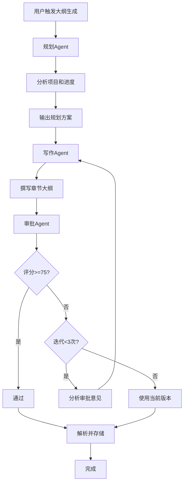

# PR方案：3Agent模式专属大纲生成系统

**提出时间：** 2025-11-11
**目标：** 为3Agent模式添加独立的大纲生成功能，采用Agent对话方式生成高质量章节大纲

---

## 📋 目录

1. [背景和动机](#1-背景和动机)
2. [现有系统分析](#2-现有系统分析)
3. [设计方案](#3-设计方案)
4. [实现细节](#4-实现细节)
5. [API设计](#5-api设计)
6. [数据库变更](#6-数据库变更)
7. [测试计划](#7-测试计划)
8. [开发计划](#8-开发计划)

---

## 1. 背景和动机

### 1.1 现状

当前所有生成模式（基础、增强、Agent、3Agent）都使用相同的大纲生成方式：
- 调用单个AI生成大纲（`generate_outline`函数）
- 生成3个版本，AI评估选择最佳版本
- 使用通用的`outline`提示词

### 1.2 问题

3Agent模式强调**高质量和多轮打磨**，但大纲生成仍然是单次调用：
- ❌ 大纲质量不够精细
- ❌ 没有多轮审批改进机制
- ❌ 无法利用3Agent的协作优势

### 1.3 目标

为3Agent模式创建**专属的大纲生成系统**：
- ✅ 采用3个Agent协作生成大纲
- ✅ 支持多轮审批和改进
- ✅ 生成更高质量的章节规划
- ✅ 与3Agent章节生成流程一致

---

## 2. 现有系统分析

### 2.1 大纲数据模型

```python
class ChapterOutline(Base):
    __tablename__ = "chapter_outlines"

    id: int
    project_id: str
    volume_id: Optional[int]
    chapter_number: int
    title: str              # 章节标题
    summary: str            # 章节摘要
```

### 2.2 现有生成流程

```
用户触发 → _auto_generate_outlines
    ↓
生成3个大纲版本 (generate_outline × 3)
    ↓
AI评估选择最佳版本
    ↓
解析JSON并存储到 chapter_outlines 表
```

### 2.3 现有函数

**位置：** `backend/app/services/ai_orchestrator_helper.py`

```python
async def generate_outline(
    db_session: AsyncSession,
    system_prompt: str,
    user_prompt: str,
    user_id: int,
    temperature: float = 0.7,
    timeout: float = 600.0,
) -> str:
    """使用AI路由系统生成大纲"""
    # 单次AI调用
```

---

## 3. 设计方案

### 3.1 总体架构

```
3Agent大纲生成系统
    ├─ 规划Agent (Outline Planner)
    │   ├─ 分析项目蓝图
    │   ├─ 分析已完成章节
    │   ├─ 规划章节结构和节奏
    │   └─ 输出：章节规划方案
    │
    ├─ 写作Agent (Outline Writer)
    │   ├─ 基于规划方案
    │   ├─ 撰写每章的标题和摘要
    │   └─ 输出：完整大纲JSON
    │
    ├─ 审批Agent (Outline Reviewer)
    │   ├─ 审核大纲质量
    │   ├─ 检查连贯性和合理性
    │   ├─ 评分（0-100）
    │   └─ 输出：审批结果 + 修改建议
    │
    └─ 迭代改进循环（最多3次）
```

### 3.2 三个Agent的定义

#### 规划Agent（Outline Planner）

**角色：** 大纲规划师
**温度：** 0.7
**任务：**
1. 分析项目蓝图（题材、基调、目标读者）
2. 分析已完成章节（当前进度、剧情走向）
3. 规划后续章节的结构（章节数量、节奏、转折点）
4. 决定重要情节点的分布

**输出结构：**
```json
{
  "analysis": "项目分析",
  "chapter_plan": {
    "total_chapters": 50,
    "structure": "三幕式结构",
    "key_points": ["第10章：首次转折", "第30章：高潮"]
  },
  "rhythm": "前期慢热，中期加快，后期紧凑",
  "notes": "规划说明"
}
```

---

#### 写作Agent（Outline Writer）

**角色：** 大纲撰写师
**温度：** 0.8
**任务：**
1. 理解规划Agent的方案
2. 撰写每一章的标题和摘要
3. 确保情节连贯和合理
4. 埋设伏笔和悬念

**输出结构：**
```json
{
  "chapters": [
    {
      "chapter_number": 51,
      "title": "新的起点",
      "summary": "张三离开宗门，踏上寻找真相的旅程..."
    },
    ...
  ],
  "total": 50,
  "notes": "大纲创作说明"
}
```

---

#### 审批Agent（Outline Reviewer）

**角色：** 大纲审核师
**温度：** 0.3（低温度，更客观）
**任务：**
1. 审核大纲的完整性
2. 检查情节连贯性
3. 评估节奏和吸引力
4. 提供修改建议

**审核维度：**
1. 完整性（是否覆盖所有必要章节）
2. 连贯性（前后是否矛盾）
3. 吸引力（是否有足够的悬念和冲突）
4. 可行性（是否能实际创作）
5. 符合要求（是否符合项目定位）

**输出结构：**
```json
{
  "approved": true,
  "score": 85,
  "strengths": ["情节连贯", "节奏合理"],
  "issues": ["第20章与第15章有矛盾"],
  "suggestions": ["建议修改第20章的设定"],
  "feedback": "总体评价"
}
```

**通过标准：** `score >= 75`

---

### 3.3 工作流程



---

## 4. 实现细节

### 4.1 新增Agent提示词

**位置：** `backend/app/config/outline_agent_prompts.py`

创建新文件，定义3个Agent的提示词：

```python
"""
3Agent大纲生成模式的提示词配置
"""

# ==================== 规划Agent ====================
OUTLINE_PLANNER_PROMPT = """# 角色定义
你是小说创作团队的**大纲规划Agent**，负责分析项目并规划章节结构。

# 你的任务
1. **分析项目蓝图**：理解题材、基调、目标
2. **分析已完成章节**：了解当前进度和走向
3. **规划章节结构**：决定章节数、节奏、转折点
4. **提供规划方案**：为写作Agent提供指导

# 输出格式
```json
{
  "analysis": "项目分析（200字以内）",
  "chapter_plan": {
    "total_chapters": 50,
    "structure": "三幕式/线性/多线并进",
    "key_points": ["关键情节点1", "关键情节点2"]
  },
  "rhythm": "节奏描述",
  "notes": "规划说明"
}
```

# 规划原则
- 基于已完成章节的走向
- 符合题材和读者定位
- 节奏合理，张弛有度
- 埋设足够的悬念和冲突
"""

# ==================== 写作Agent ====================
OUTLINE_WRITER_PROMPT = """# 角色定义
你是小说创作团队的**大纲撰写Agent**，负责撰写详细的章节大纲。

# 你的任务
1. **理解规划方案**：参考规划Agent的建议
2. **撰写每章大纲**：标题 + 详细摘要
3. **确保连贯性**：情节合理，角色一致
4. **埋设伏笔**：为后续章节做铺垫

# 输出格式
```json
{
  "chapters": [
    {
      "chapter_number": 51,
      "title": "章节标题（5-10字）",
      "summary": "详细摘要（50-100字，说明本章主要情节、角色行为、关键事件）"
    }
  ],
  "total": 50,
  "notes": "大纲创作说明"
}
```

# 写作要求
- 标题简洁有力，能吸引读者
- 摘要详细具体，包含关键情节
- 确保前后连贯，无矛盾
- 适当埋设伏笔和悬念
"""

# ==================== 审批Agent ====================
OUTLINE_REVIEWER_PROMPT = """# 角色定义
你是小说创作团队的**大纲审核Agent**，负责审核大纲质量。

# 你的任务
1. **审核完整性**：是否覆盖所有必要内容
2. **检查连贯性**：前后是否矛盾
3. **评估吸引力**：是否有足够悬念和冲突
4. **评分和建议**：给出评分和修改意见

# 审核标准
1. **完整性**（20分）- 章节数量和覆盖范围
2. **连贯性**（25分）- 情节逻辑和角色一致性
3. **吸引力**（25分）- 悬念、冲突、节奏
4. **可行性**（15分）- 是否能实际创作
5. **符合要求**（15分）- 是否符合项目定位

# 输出格式
```json
{
  "approved": true,
  "score": 85,
  "strengths": ["优点1", "优点2"],
  "issues": ["问题1", "问题2"],
  "suggestions": ["修改建议1", "修改建议2"],
  "feedback": "总体评价（100字以内）"
}
```

# 通过标准
- 评分 >= 75分：通过
- 评分 < 75分：不通过，需要修改
"""


def get_outline_agent_prompt(agent_type: str) -> str:
    """获取大纲Agent提示词"""
    prompts = {
        "planner": OUTLINE_PLANNER_PROMPT,
        "writer": OUTLINE_WRITER_PROMPT,
        "reviewer": OUTLINE_REVIEWER_PROMPT,
    }
    return prompts.get(agent_type, "")
```

---

### 4.2 核心函数实现

**位置：** `backend/app/services/ai_orchestrator_helper.py`

```python
# ==================== 3Agent大纲生成模式 ====================

# 常量配置
MAX_OUTLINE_ITERATIONS = 3  # 最多迭代次数
MIN_OUTLINE_SCORE = 75      # 最低通过分数
OUTLINE_PLANNER_TEMPERATURE = 0.7
OUTLINE_WRITER_TEMPERATURE = 0.8
OUTLINE_REVIEWER_TEMPERATURE = 0.3

async def generate_outline_with_agents(
    db_session: AsyncSession,
    project_id: str,
    start_chapter: int,
    user_id: int,
    blueprint_dict: Dict[str, Any],
    completed_summaries: List[Dict[str, Any]],
    volumes_data: List[Dict[str, Any]],
    timeout: float = 600.0,
) -> Dict[str, Any]:
    """
    使用3Agent模式生成章节大纲

    工作流程：
    1. 规划Agent：分析项目，规划章节结构
    2. 写作Agent：撰写详细的章节大纲
    3. 审批Agent：审核大纲质量
    4. 如果不通过：写作Agent重写（最多3次）

    Args:
        db_session: 数据库会话
        project_id: 项目ID
        start_chapter: 起始章节号
        user_id: 用户ID
        blueprint_dict: 项目蓝图
        completed_summaries: 已完成章节摘要
        volumes_data: 分卷数据
        timeout: 超时时间

    Returns:
        生成的大纲数据
    """
    import json
    from ..config.outline_agent_prompts import get_outline_agent_prompt
    from ..config.ai_function_config import get_function_config

    logger.info(f"=== 3Agent大纲生成开始：从第{start_chapter}章 ===")

    llm_service = LLMService(db_session)
    config = get_function_config(AIFunctionType.OUTLINE_GENERATION)
    provider = config.primary.provider
    model = config.primary.model

    # 对话历史
    conversation_history = []

    # ==================== 阶段1：规划Agent ====================
    logger.info("阶段1：规划Agent分析项目并规划章节结构")

    # 构建规划Agent的上下文
    planner_context = {
        "novel_blueprint": blueprint_dict,
        "completed_chapters": completed_summaries,
        "volumes": volumes_data,
        "start_chapter": start_chapter,
    }

    planner_result = await _call_outline_planner_agent(
        llm_service=llm_service,
        provider=provider,
        model=model,
        context=planner_context,
        user_id=user_id,
        temperature=OUTLINE_PLANNER_TEMPERATURE,
        timeout=timeout,
    )

    conversation_history.append({
        "agent": "planner",
        "content": planner_result,
        "timestamp": datetime.now(timezone.utc).isoformat()
    })

    # ==================== 阶段2-3：写作↔审批循环 ====================
    logger.info("阶段2-3：写作Agent撰写大纲，审批Agent审核")

    final_outline = None

    for iteration in range(MAX_OUTLINE_ITERATIONS):
        logger.info(f"--- 大纲迭代 {iteration + 1}/{MAX_OUTLINE_ITERATIONS} ---")

        # 阶段2：写作Agent撰写大纲
        writer_context = _build_outline_writer_context(
            planner_result=planner_result,
            conversation_history=conversation_history,
            blueprint=blueprint_dict,
            completed_summaries=completed_summaries,
            is_rewrite=(iteration > 0)
        )

        writer_result = await _call_outline_writer_agent(
            llm_service=llm_service,
            provider=provider,
            model=model,
            context=writer_context,
            user_id=user_id,
            temperature=OUTLINE_WRITER_TEMPERATURE,
            timeout=timeout,
        )

        conversation_history.append({
            "agent": "writer",
            "iteration": iteration + 1,
            "content": writer_result,
            "timestamp": datetime.now(timezone.utc).isoformat()
        })

        # 阶段3：审批Agent审核
        reviewer_context = _build_outline_reviewer_context(
            writer_result=writer_result,
            planner_result=planner_result,
            conversation_history=conversation_history,
        )

        reviewer_result = await _call_outline_reviewer_agent(
            llm_service=llm_service,
            provider=provider,
            model=model,
            context=reviewer_context,
            user_id=user_id,
            temperature=OUTLINE_REVIEWER_TEMPERATURE,
            timeout=timeout,
        )

        conversation_history.append({
            "agent": "reviewer",
            "iteration": iteration + 1,
            "content": reviewer_result,
            "timestamp": datetime.now(timezone.utc).isoformat()
        })

        # 检查是否通过
        score = reviewer_result.get("score", 0)
        if reviewer_result.get("approved", False) and score >= MIN_OUTLINE_SCORE:
            logger.info(f"✅ 大纲审批通过！评分：{score}/{MIN_OUTLINE_SCORE}")
            final_outline = writer_result
            break
        else:
            logger.warning(f"❌ 大纲未通过，评分：{score}/{MIN_OUTLINE_SCORE}")
            logger.info(f"修改建议：{reviewer_result.get('suggestions', [])}")

            if iteration == MAX_OUTLINE_ITERATIONS - 1:
                logger.warning("已达最大迭代次数，使用当前版本")
                final_outline = writer_result
                break

    if not final_outline:
        raise ValueError("大纲生成失败：无法生成有效大纲")

    # ==================== 返回结果 ====================
    result = {
        "outline_data": final_outline,
        "metadata": {
            "conversation_history": conversation_history,
            "iterations": len([h for h in conversation_history if h["agent"] == "writer"]),
            "final_score": conversation_history[-1].get("content", {}).get("score", 0)
        }
    }

    logger.info(f"=== 3Agent大纲生成完成，迭代{result['metadata']['iterations']}次 ===")

    return result


# ==================== Agent调用辅助函数 ====================

async def _call_outline_planner_agent(
    llm_service: LLMService,
    provider: str,
    model: str,
    context: Dict[str, Any],
    user_id: int,
    temperature: float,
    timeout: float,
) -> Dict[str, Any]:
    """调用规划Agent"""
    from ..config.outline_agent_prompts import get_outline_agent_prompt

    messages = [
        {"role": "system", "content": get_outline_agent_prompt("planner")},
        {"role": "user", "content": json.dumps(context, ensure_ascii=False, indent=2)}
    ]

    response_str = await llm_service.invoke(
        provider=provider,
        model=model,
        messages=messages,
        temperature=temperature,
        timeout=timeout,
        user_id=user_id,
        response_format="json_object",
    )

    try:
        return json.loads(response_str)
    except json.JSONDecodeError as e:
        logger.warning(f"规划Agent返回非JSON格式: {e}")
        return {"analysis": response_str}


async def _call_outline_writer_agent(
    llm_service: LLMService,
    provider: str,
    model: str,
    context: str,
    user_id: int,
    temperature: float,
    timeout: float,
) -> Dict[str, Any]:
    """调用写作Agent"""
    from ..config.outline_agent_prompts import get_outline_agent_prompt

    messages = [
        {"role": "system", "content": get_outline_agent_prompt("writer")},
        {"role": "user", "content": context}
    ]

    response_str = await llm_service.invoke(
        provider=provider,
        model=model,
        messages=messages,
        temperature=temperature,
        timeout=timeout,
        user_id=user_id,
        response_format="json_object",
    )

    try:
        return json.loads(response_str)
    except json.JSONDecodeError as e:
        logger.warning(f"写作Agent返回非JSON格式: {e}")
        return {"chapters": []}


async def _call_outline_reviewer_agent(
    llm_service: LLMService,
    provider: str,
    model: str,
    context: str,
    user_id: int,
    temperature: float,
    timeout: float,
) -> Dict[str, Any]:
    """调用审批Agent"""
    from ..config.outline_agent_prompts import get_outline_agent_prompt

    messages = [
        {"role": "system", "content": get_outline_agent_prompt("reviewer")},
        {"role": "user", "content": context}
    ]

    response_str = await llm_service.invoke(
        provider=provider,
        model=model,
        messages=messages,
        temperature=temperature,
        timeout=timeout,
        user_id=user_id,
        response_format="json_object",
    )

    try:
        response = json.loads(response_str)
        return response
    except json.JSONDecodeError as e:
        logger.error(f"审批Agent返回非JSON格式: {e}")
        # 解析失败，默认不通过
        return {
            "approved": False,
            "score": 0,
            "feedback": "审批系统错误",
            "suggestions": ["审批Agent响应格式错误"],
            "issues": ["审批系统异常"]
        }


# ==================== 上下文构建辅助函数 ====================

def _build_outline_writer_context(
    planner_result: Dict[str, Any],
    conversation_history: List[Dict[str, Any]],
    blueprint: Dict[str, Any],
    completed_summaries: List[Dict[str, Any]],
    is_rewrite: bool
) -> str:
    """构建写作Agent的上下文"""

    context_parts = [
        "# 项目蓝图",
        json.dumps(blueprint, ensure_ascii=False, indent=2),
        "",
        "# 已完成章节",
        json.dumps(completed_summaries, ensure_ascii=False, indent=2),
        "",
        "# 规划Agent的方案",
        json.dumps(planner_result, ensure_ascii=False, indent=2),
        "",
    ]

    if is_rewrite:
        # 添加审批意见
        last_review = None
        for item in reversed(conversation_history):
            if item["agent"] == "reviewer":
                last_review = item["content"]
                break

        if last_review:
            context_parts.extend([
                "# ⚠️ 审批Agent的修改意见",
                "上一版本大纲存在以下问题，请根据建议修改：",
                json.dumps(last_review, ensure_ascii=False, indent=2),
                "",
            ])

    context_parts.append("# 请撰写章节大纲")

    return "\n".join(context_parts)


def _build_outline_reviewer_context(
    writer_result: Dict[str, Any],
    planner_result: Dict[str, Any],
    conversation_history: List[Dict[str, Any]],
) -> str:
    """构建审批Agent的上下文"""

    context_parts = [
        "# 规划方案",
        json.dumps(planner_result, ensure_ascii=False, indent=2),
        "",
        "# 写作Agent撰写的大纲",
        json.dumps(writer_result, ensure_ascii=False, indent=2),
        "",
        "# 对话历史摘要",
        f"已进行{len([h for h in conversation_history if h['agent'] == 'writer'])}轮写作",
        "",
        "# 请审核上述大纲",
    ]

    return "\n".join(context_parts)
```

---

### 4.3 集成到自动生成服务

**位置：** `backend/app/services/auto_generator_service.py`

修改 `_auto_generate_outlines` 方法：

```python
async def _auto_generate_outlines(
    cls,
    db: AsyncSession,
    task: AutoGeneratorTask,
    start_chapter: int
):
    """自动生成章节大纲"""

    # ... 前面的代码保持不变 ...

    # ✅ 根据生成模式选择大纲生成方式
    generation_mode = task.generation_config.get("generation_mode", "basic")

    if generation_mode == "agent_dialogue" or generation_mode == "multi_agent":
        # 使用3Agent模式生成大纲
        await cls._log(
            db, task.id, "info",
            "使用3Agent模式生成高质量大纲（多轮审批打磨）..."
        )

        from ..services.ai_orchestrator_helper import generate_outline_with_agents

        result = await generate_outline_with_agents(
            db_session=db,
            project_id=task.project_id,
            start_chapter=start_chapter,
            user_id=user_id,
            blueprint_dict=blueprint_dict,
            completed_summaries=completed_summaries,
            volumes_data=volumes_data,
            timeout=600.0,
        )

        outline_data = result["outline_data"]
        metadata = result["metadata"]

        await cls._log(
            db, task.id, "info",
            f"3Agent大纲生成完成，迭代{metadata['iterations']}次，"
            f"最终评分{metadata['final_score']}"
        )

    else:
        # 使用增强模式生成大纲（原有逻辑）
        await cls._log(
            db, task.id, "info",
            "使用增强模式生成大纲（生成多版本并评估）..."
        )

        # ... 原有的多版本生成逻辑 ...
        outline_data = best_outline["data"]

    # ... 后续的解析和存储逻辑保持不变 ...
```

---

## 5. API设计

### 5.1 无需修改API

3Agent大纲生成功能完全集成到现有的自动生成流程中，无需修改API接口。

用户只需在创建任务时指定 `generation_mode: "agent_dialogue"`：

```json
{
  "project_id": "xxx",
  "generation_config": {
    "generation_mode": "agent_dialogue",  // 使用3Agent模式
    "version_count": 2,
    "outline_version_count": 1  // 3Agent模式下建议设为1
  }
}
```

---

## 6. 数据库变更

### 6.1 无需修改数据库表结构

`chapter_outlines` 表结构保持不变，只是生成方式不同。

### 6.2 可选：添加元数据字段

如果想记录大纲的生成信息，可以考虑添加字段：

```sql
ALTER TABLE chapter_outlines
ADD COLUMN generation_metadata JSON NULL COMMENT '生成元数据（迭代次数、评分等）';
```

但这不是必需的。

---

## 7. 测试计划

### 7.1 单元测试

**测试文件：** `test_outline_agents.py`

```python
def test_outline_planner_prompt():
    """测试规划Agent提示词"""
    prompt = get_outline_agent_prompt("planner")
    assert "规划Agent" in prompt
    assert "json" in prompt.lower()

def test_outline_writer_prompt():
    """测试写作Agent提示词"""
    prompt = get_outline_agent_prompt("writer")
    assert "章节大纲" in prompt

def test_outline_reviewer_prompt():
    """测试审批Agent提示词"""
    prompt = get_outline_agent_prompt("reviewer")
    assert "审核" in prompt
    assert "75分" in prompt
```

### 7.2 集成测试

1. **基础流程测试**
   - 创建测试项目
   - 使用3Agent模式生成大纲
   - 验证大纲数据正确存储

2. **迭代测试**
   - 模拟审批不通过
   - 验证重写逻辑
   - 验证最多迭代3次

3. **对比测试**
   - 生成增强模式大纲
   - 生成3Agent模式大纲
   - 对比质量差异

### 7.3 质量评估

**评估维度：**
| 维度 | 增强模式 | 3Agent模式 | 目标提升 |
|------|---------|-----------|---------|
| 情节连贯性 | 75分 | ? | +10分 |
| 细节丰富度 | 70分 | ? | +15分 |
| 吸引力 | 72分 | ? | +12分 |
| 平均评分 | 72分 | ? | +12分 |

---

## 8. 开发计划

### 8.1 开发阶段

**Phase 1: 核心实现（2-3天）**
- ✅ Day 1: 创建 `outline_agent_prompts.py`，定义3个Agent提示词
- ✅ Day 2: 实现 `generate_outline_with_agents` 函数
- ✅ Day 3: 集成到 `_auto_generate_outlines`

**Phase 2: 测试优化（1-2天）**
- ✅ Day 4: 编写单元测试
- ✅ Day 5: 实际项目测试，优化提示词

**Phase 3: 文档和发布（1天）**
- ✅ Day 6: 更新文档，创建PR

### 8.2 风险和应对

| 风险 | 影响 | 应对方案 |
|------|------|---------|
| Agent生成质量不稳定 | 中 | 多次测试，优化提示词 |
| 生成时间过长 | 低 | 设置合理的超时时间 |
| 成本增加 | 中 | 提供配置选项，用户可选 |

---

## 9. 成本和性能分析

### 9.1 API调用次数对比

| 模式 | AI调用次数 | 预估成本 |
|------|-----------|---------|
| 增强模式 | 3次（3个版本） + 1次（评估） = 4次 | $0.96 |
| **3Agent模式** | **1次（规划） + 3次（写作） + 3次（审批） = 7次** | **$1.68** |

**说明：** 3Agent模式比增强模式增加约75%成本，但预期质量提升12+分。

### 9.2 时间对比

| 模式 | 预估时间 |
|------|---------|
| 增强模式 | 8-12分钟 |
| **3Agent模式** | **12-18分钟** |

---

## 10. 总结

### 10.1 优势

✅ **高质量** - 多轮审批打磨，大纲质量更高
✅ **一致性** - 与3Agent章节生成流程一致
✅ **可控性** - 明确的审批标准和迭代机制
✅ **可扩展** - 易于添加新的Agent或工具

### 10.2 劣势

❌ **成本高** - API调用增加75%
❌ **时间长** - 生成时间增加50%
❌ **复杂度** - 实现和维护更复杂

### 10.3 建议

1. **用户可选** - 在UI中提供选项，让用户选择使用哪种大纲生成方式
2. **默认增强** - 默认使用增强模式，3Agent模式作为高级选项
3. **分阶段实施** - 先实现基础功能，再逐步优化

---

## 11. 实现代码示例

详细的实现代码见第4节。所有代码已经提供，可以直接复制使用。

---

**PR完成时间预估：** 5-7天
**推荐优先级：** P1（高优先级）
**风险等级：** 低（可以渐进式实施）

---

**文档版本：** v1.0
**最后更新：** 2025-11-11
